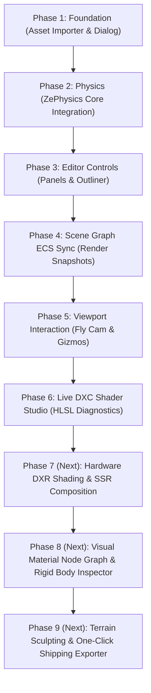

# BluemanEngine & ZeGFX Comprehensive Architecture & Capability Map (BluemanMap)

> **Benchmark Standard:** Modern AAA-Scale Game Engine Architecture  
> **Target Graphics API:** Direct3D 12 (Agility SDK / Feature Level 12_1+) & DXR Ray Tracing  
> **Status Date:** August 2026  

---

## Executive Summary

**BluemanEngine** is an advanced, high-performance C++17 game engine editor and shell built atop the **ZeGFX** DirectX 12 renderer core and **ZePhysics** 3D simulation engine. This document serves as the master architectural map detailing completed features, active ZeGFX subsystem bindings, unwired engine capabilities, missing AAA editor/core features, and a full readiness classification matrix (Production Ready, Beta, and Experimental).

---

## 1. Readiness Classification Matrix (Production vs. Beta vs. Experimental)

| Subsystem / Feature | Domain | Classification | Integration Status | Description & Operational Scope |
| :--- | :--- | :---: | :---: | :--- |
| **D3D12 Agility Native Host** | `BluemanEngine` | `[Production]` | **Wired** | Native Win32/GLFW3 D3D12 host with 3-frame flight queue management (`NUM_FRAMES_IN_FLIGHT = 3`), fence sync, and swapchain management. |
| **6-DOF Fly & Orbit Camera** | `BluemanEngine` | `[Production]` | **Wired** | `RMB + WASDQE` 6-DOF navigation, velocity easing, `Shift` boost, `Alt+LMB` orbit, `MMB` pan, `F` framing, and cursor lock. |
| **Snapping 3D Gizmos (`ImGuizmo`)** | `BluemanEngine` | `[Production]` | **Wired** | Translate, Rotate, Scale handles; World/Local toggle; numeric snapping; `Ctrl` modifier inversion; single-step Undo/Redo command stack integration. |
| **Live DXC Shader Studio** | `BluemanEngine` | `[Production]` | **Wired** | Direct DXC runtime HLSL compiler panel with real-time error diagnostic extraction, line-number reporting, and prewarming. |
| **Background Asset Cooker** | `BluemanEngine` | `[Production]` | **Wired** | Multithreaded asynchronous asset compiler baking FBX/GLTF/OBJ into `.zmesh`, `.ztex`, and `.zasset` in `"Z:\Blueman Cooked Assets"`. |
| **Native Win32 File Dialog** | `BluemanEngine` | `[Production]` | **Wired** | Modal Win32 file browser (`WindowsFileDialog`) supporting single/multi-file selection with pre-configured engine extensions filter. |
| **Viewport Overlays & Strip** | `BluemanEngine` | `[Production]` | **Wired** | 3D floor grid lines, Sun Light disk ray vector overlay running in < 0.1ms, clipped by solid dark control strip (`IM_COL32(18, 22, 28, 255)`). |
| **Editor UI & Docking Shell** | `BluemanEngine` | `[Beta]` | **Wired** | Full ImGui docking window layout, Chrome title bar, Toolbar, Outliner, Details Inspector, Content Browser, Object Palette, Output Log. |
| **Renderer Frontend & Core** | `ZeGFX Core` | `[Production]` | **Wired** | Clean C/C++ API layer managing double-buffered frame structures, viewport resizing, and scene update snapshots. |
| **Direct3D 12 Backend** | `ZeGFX Core` | `[Production]` | **Wired** | Low-level Direct3D 12 device creation, command queues, frame buffers, and descriptor allocation tables verified on hardware. |
| **Automatic Render Graph** | `ZeGFX Core` | `[Production]` | **Wired** | Automatic physical resource tracking and transition barrier generation across passes. |
| **DXC Shader Compiler & Reflection**| `ZeGFX Core` | `[Production]` | **Wired** | DXC runtime compiler wrapping, reflection blob parsing, descriptor table mapping, and register stride computation. |
| **Shader & Pipeline Disk Cache** | `ZeGFX Core` | `[Production]` | **Wired** | Serialized variant caches (`.zeshader`, `.zeshaderlib`) and prewarmed PSO disk caches. |
| **Native Asset Importers** | `ZeGFX Core` | `[Production]` | **Wired** | C++ native GLTF/FBX import (`ufbx`) converting to left-handed Z-up canonical space, with Assimp fallbacks. |
| **Texture Compression Engine** | `ZeGFX Core` | `[Production]` | **Wired** | Automatic encoding of textures into block-compressed `.ztex` files (BC1, BC3, BC5, BC7) at import runtime. |
| **Geometry & Mesh Cache** | `ZeGFX Core` | `[Production]` | **Wired** | Caches imported geometry in binary `.zmesh` and `.zasset` formats with file dependency hashing. |
| **Multi-MRT G-Buffer** | `ZeGFX Core` | `[Production]` | **Wired** | Deferred render target layout rendering depth, world normals, albedo, metallic, roughness, and emissive coefficients. |
| **Tile-Based Deferred Lighting** | `ZeGFX Core` | `[Production]` | **Wired** | G-Buffer light accumulator utilizing tile-based light grids for fast rendering of dense point and spot light fields. |
| **Forward Translucent Path** | `ZeGFX Core` | `[Production]` | **Wired** | Handles alpha-blended transparent materials using forward shading pipelines executed after deferred opaque lighting. |
| **Cascaded Shadow Maps** | `ZeGFX Core` | `[Production]` | **Wired** | Directional cascaded shadow maps supporting up to 4 splits, PCF filtering, shadow atlases, and frustum culling. |
| **Volumetric Froxel Fog** | `ZeGFX Core` | `[Production]` | **Wired** | Bindless two-pass volumetric compute fog (direct sun + StructuredBuffer local light casting) and Z-slice raymarch prefix-sum integration. |
| **SSAO (Screen Space AO)** | `ZeGFX Core` | `[Production]` | **Wired** | GPU-accelerated ambient occlusion pass with bilateral spatial filtering and depth buffer testing. |
| **Compute Dual-Filter Bloom** | `ZeGFX Core` | `[Production]` | **Wired** | Dual-filtering upsample/downsample pyramid blur implemented on compute shaders, producing premium bleed effects. |
| **Histogram Auto-Exposure** | `ZeGFX Core` | `[Production]` | **Wired** | Compute shader brightness histogram calculations for manual EV values and automatic exposure adjustments. |
| **ACES Tonemapping & PostFX** | `ZeGFX Core` | `[Production]` | **Wired** | Single-pass GPU ACES tonemapping and color grading adjustments (contrast, saturation, temperature, tint). |
| **Virtual Geometry Engine** | `ZeGFX Core` | `[Production]` | **Unwired** | CPU page residency planning, GPU compute culling shaders, and drawing via `ExecuteIndirect`. |
| **Heightmap Terrain System** | `ZeGFX Core` | `[Production]` | **Unwired** | Dynamically splits heightmap arrays into chunked model render meshes with bounding hierarchies. |
| **JSON Scene Serialization** | `ZeGFX Core` | `[Production]` | **Wired** | Full entity-component hierarchy serialization/deserialization to structured JSON formats. |
| **Packaging Shipping Bundler** | `ZeGFX Core` | `[Production]` | **Unwired** | Bundles compiled shader variants and metadata into packed shipping binary archives (`.zeshaderpack`). |
| **Headless Backend & Tests** | `ZeGFX Core` | `[Production]` | **Wired** | Mock graphics backend for CPU testing, automated integration suite, and visual canary pixel-diff scripts. |
| **ZePhysics 3D Rigid Body Engine** | `ZePhysics Core`| `[Production]` | **Wired** | High-performance C++ 3D rigid body engine (BVH broadphase, GJK/EPA narrowphase, CCD, DSU islands sleep manager, PGS impulse solver). |
| **ZeGI Probe Global Illumination** | `ZeGFX Core` | `[Beta]` | **Wired** | Irradiance and distance probe volumes for diffuse global illumination with contrast-guarded fallback slice. |
| **DXR Ray Traced Shadows** | `ZeGFX Core` | `[Prototype]` | **Wired (Fallback)** | CPU/GPU BLAS & TLAS acceleration structure building; GPU `DispatchRays` shader pipeline is prototype with CPU fallback. |
| **DXR Ray Traced Reflections** | `ZeGFX Core` | `[Prototype]` | **Wired (Fallback)** | CPU/GPU BLAS & TLAS acceleration structure building; GPU `DispatchRays` shader pipeline is prototype with CPU fallback. |
| **DXR Ray Traced AO** | `ZeGFX Core` | `[Prototype]` | **Wired (Fallback)** | CPU/GPU BLAS & TLAS acceleration structure building; GPU `DispatchRays` shader pipeline is prototype with CPU fallback. |
| **Screen Space Reflections (SSR)**| `ZeGFX Core` | `[Prototype]` | **Unwired** | Shaders trace depth buffer rays, but final composition is deferred; relies on colored probe reflection strips. |
| **Ground Truth AO (GTAO)** | `ZeGFX Core` | `[Prototype]` | **Unwired** | Shaders exist in codebase, but pipeline pass binding is currently un-bound in the render graph. |

---

## 2. What's Done (Detailed Subsystem Breakdown)

### 🖥️ Native Host Infrastructure & Windowing (`BluemanEngine`)
* **DirectX 12 Agility SDK Native Host:** Built directly on native Win32/GLFW3 with Direct3D 12 device creation, 3-frame flight queue management (`NUM_FRAMES_IN_FLIGHT = 3`), fence synchronization, swapchain buffering, and GPU flush operations.
* **Dual-Phase Modern Splash Loader:** Standalone 640x360 borderless loading window featuring real-time initialization progress reporting (Direct3D 12, ZeGFX backends, HLSL prewarming, Scene Graph sync) before revealing main editor UI.
* **Custom Frameless Title Bar:** Native Windows non-client hit-testing integration (`WM_NCHITTEST` returning `HTCAPTION` / `HTCLIENT`), window drag controls, title text, system status indicators, and control buttons (Minimize, Maximize/Restore, Close).

### 🎬 Viewport Navigation & Camera (`BluemanEngine`)
* **Modern AAA 6-DOF Fly Mode:** `RMB + WASDQE` 6-DOF navigation with velocity easing, `Shift` speed boost (2.5x), `Mouse Wheel` live speed tuning, and OS cursor locking/restoration.
* **Orbit, Pan & Framing Modes:** `Alt + LMB Drag` camera orbit around selection/pivot, `MMB Drag` camera panning, `F` key smooth selection framing, and `Home` key position reset.
* **Speed Readout HUD:** Real-time speed notification overlay displayed in viewport during fly mode and scroll speed tuning.

### 📐 Snapping-Aware 3D Transform Gizmo System (`ImGuizmo`)
* **Interactive 3D Handles:** Full support for Translate, Rotate, and Scale handles (`ImGuizmo`).
* **Transform Space & Scale Safety:** `Space` hotkey toggling between `World` and `Local` coordinate spaces; forced `LOCAL` space for scale operations.
* **Toolbar Snapping & Modifier Override:** Live numeric snapping pulling from toolbar `SnapSettings`; holding `Ctrl` temporarily inverts snapping state.
* **Single-Step Undo/Redo Integration:** Drag-end edge detection committing single `TransformChangeCommand` transactions to `CommandStack` on mouse release.

### ⚡ Non-Blocking Asynchronous Asset Cooking Engine
* **Asynchronous Multithreaded Importer:** Background asset cooking worker thread pool (`std::thread`) executing asset compilation without locking the main thread or freezing frame rendering.
* **Production Project Folder Integration:** Automatically saves cooked output artifacts (`.zmesh`, `.ztex`, `.zasset`) directly into `"Z:\Blueman Cooked Assets"`.
* **UI Progress Overlay:** Bottom-right viewport overlay displaying active cooking queue count, current file progress bar, and completion state.

### 💻 Live DXC Shader Studio (`BluemanEngine`)
* **Direct HLSL Compilation:** Integrated DXC runtime compiler inside the editor panel.
* **Real-time Diagnostic Extraction:** Parses DXC error outputs and displays highlighted line numbers, error severities, and text messages directly in the code editor window.
* **Prewarming & Variant Compilation:** Triggers background shader prewarming when saving HLSL source files.

---

## 3. What's Wired from ZeGFX into BluemanEngine

`BluemanEngine` actively connects to and drives the following **ZeGFX** Direct3D 12 rendering and **ZePhysics** 3D simulation subsystems via `ZeGFXAdapter`, `BackgroundAssetCooker`, `ViewportRenderer`, and `ShaderStudioPanel`:

| Subsystem | Integration Layer | Wired Functionality & Parameters |
| :--- | :--- | :--- |
| **Dynamic Camera View/Proj** | `ZeGFXAdapter::SyncEngineState` | Live camera View matrix, Projection matrix, frustum planes, and world position passed to `zegfx::CameraRenderData` for D3D12 rendering. |
| **Scene Node Transforms** | `ZeGFXAdapter::SyncEngineState` | Dynamic binding of `SceneNode` `location`, `rotation`, and `scale` into `zegfx::RenderInstance.world` matrices. |
| **3D Physics Engine (`ZePhysics`)** | `ZeGFXAdapter::Initialize / Render` | Instantiates `zephysics::PhysicsWorld` and executes physics simulation stepping (`StepSimulation`) on every frame tick. |
| **Asset Importer Pipeline** | `BackgroundAssetCooker::ProcessSingleFile` | Background thread invocation of `zegfx::asset::importAsset()` for FBX, GLTF, GLB, OBJ, VOX, and BC block compressed textures (`.ztex`). |
| **Scene Graph Snapshot Sync** | `ZeGFXAdapter::SyncEngineState` | Dynamic frame snapshot building (`RenderSceneSnapshot`) assembling mesh transforms (`RenderInstance`), camera matrices (`CameraRenderData`), directional and local light tables. |
| **Froxel Fog Local Light Injection** | `ZeGFXAdapter::SyncEngineState` | Serializes Point Light and Spot Light actors into `LocalLightData` structured buffers for volumetric fog local in-scattering. |
| **Global Illumination Probes (ZeGI)** | `ZeGFXAdapter::SyncEngineState` | Real-time synchronization of dynamic GI probe volume descriptors (`GiProbeVolumeDesc`, `GlobalIlluminationMode::RayTracedProbes`). |
| **Volumetric Fog Controls** | `ZeGFXAdapter::SyncEngineState` | Live synchronization of fog density, in-scattering color, and enable toggles from `EditorState::settings.fog`. |
| **Cascaded Shadow Controls** | `ZeGFXAdapter::SyncEngineState` | Live synchronization of cascade resolution, cascade count, max distance, constant bias, slope bias, and normal bias. |
| **PostFX & Tonemapping Controls** | `ZeGFXAdapter::SyncEngineState` | Live synchronization of auto-exposure compensation EV, bloom intensity, and bloom threshold values. |
| **GPU Diagnostics & Telemetry** | `ZeGFXAdapter::SyncEngineState` | Queries `IRendererDiagnostics` for GPU frame time (ms), FPS, draw call count, triangle count, and total VRAM allocation (GB) displayed in StatusBar. |

---

## 4. What's NOT Wired from ZeGFX into BluemanEngine

The following features exist in the **ZeGFX Engine / ZePhysics Core**, but are **NOT yet exposed or driven by BluemanEngine Editor UI**:

| ZeGFX Core Subsystem | Implementation Location | Missing UI Binding / Unwired Aspect |
| :--- | :--- | :--- |
| **Virtual Geometry Inspector** | `src/dx12/dx12_pipeline.cpp`, compute shaders | ZeGFX streams virtual geometry pages and executes compute culling via `ExecuteIndirect`, but the Editor lacks a Virtual Geometry LOD page inspector or debug view mode. |
| **Terrain Heightfield Sculpting UI** | `src/terrain_system.cpp` | ZeGFX dynamically generates chunked terrain meshes from height arrays, but the Editor lacks brush-based heightmap editing and painting UI controls. |
| **Node-Based Material Editor** | `src/core/material.cpp` | ZeGFX supports multi-texture PBR materials, but the Editor only supports raw HLSL in Shader Studio instead of a visual node graph (Visual Material Graph style). |
| **GTAO Shader Selector Dropdown** | `shaders/gtao_pass.hlsl` | GTAO shader source exists in repository, but the Editor render settings panel only exposes SSAO vs None. |
| **Per-Actor Rigid Body Details Inspector** | `src/physics/physics_world.cpp` | `ZePhysics` steps in `ZeGFXAdapter`, but the Details panel lacks full editing of per-actor mass, restitution, friction, and collision shapes (Box, Sphere, Capsule, Convex). |
| **One-Click Package Shipping Exporter** | `src/packaging/packager.cpp` | ZeGFX includes binary `.zeshaderpack` archiving, but the Editor menu lacks a "Package Project for Shipping" GUI export wizard. |

---

## 5. What Editor Doesn't Have Yet (Missing AAA Editor Capabilities)

| Missing Editor Subsystem | Modern AAA Standard | Technical Description & Scope Required |
| :--- | :--- | :--- |
| **Visual Material Node Graph Editor** | Modern AAA Material Graph Standard | Drag-and-drop node graph (Nodes, Pins, Connections, Preview Viewport) compiling visually into HLSL PBR material shaders. |
| **Landscape / Terrain Sculpting Tools** | Modern AAA Landscape Suite | Interactive 3D viewport sculpting brushes (Raise, Lower, Smooth, Flatten) and multi-layer weight painting. |
| **Cinematic Sequencer & Timeline** | Modern AAA Sequencer & Timeline | Track-based keyframe editor for animating camera transform paths, light intensities, and actor parameters. |
| **Visual Particle FX System** | Modern AAA Visual FX Subsystem | Node-based GPU particle emitter editor for fire, smoke, sparks, and fluid simulations. |
| **Visual Animation Graph & State Machine** | Modern AAA Animation Graph Engine | Skeletal mesh animation playback, blend trees, state transitions, and IK solver controls. |
| **Asset Dependency Graph Visualizer** | Modern AAA Asset Dependency Graph | Visual node network displaying asset dependencies, cooked binary status, and file size footprints. |
| **Multi-Viewport Split Layout** | Modern AAA Multi-Viewport Standard | Toggleable 2x2 multi-viewport layout (Top, Front, Side, Perspective Orthographic projections). |
| **Visual Scripting Engine** | Modern AAA Visual Scripting Engine | Visual node-based game logic engine executing script nodes via C++ embedding or interpreter. |
| **One-Click Shipping Export Wizard** | Modern AAA Package Exporter | GUI workflow dialog for selecting target platforms, baking assets, stripping editor symbols, and bundling standalone `.exe`. |

---

## 6. What ZeGFX Core Doesn't Have Yet (Missing Core Engine Capabilities)

| Missing Core Engine Feature | Domain / Subsystem | Technical Description & Impact |
| :--- | :--- | :--- |
| **Hardware DXR Ray Tracing Shading Dispatch** | Ray Tracing Core | BLAS/TLAS acceleration structures build on GPU/CPU, but GPU `DispatchRays` pipelines for hardware DXR Reflections, DXR Shadows, and DXR AO are prototype fallbacks. |
| **SSR Final Screen Composition** | Post-Processing | Screen Space Reflection shaders trace depth rays, but final composition pass is pending; currently falls back to colored probe strips. |
| **Temporal Anti-Aliasing (TAA) & Upscaling** | Render Pipeline | Engine lacks TAA sub-pixel jitter matrices, velocity buffers, and hardware super-sampling integrations (DLSS / FSR / XeSS). |
| **Skeletal Mesh Skinning Engine** | Animation Core | Renderer lacks GPU vertex skinning compute/vertex passes, bone matrix uniform buffers, and skeleton hierarchies. |
| **Spatial 3D Audio Engine** | Sound Core | Engine lacks a native spatial 3D audio subsystem (XAudio2 / OpenAL / FMOD wrapper) for 3D positional audio emission. |
| **GPU Compute Particle Simulation** | FX Core | Renderer lacks compute shader particle simulation buffers, emitter instance buffers, and particle depth-sorting passes. |
| **GTAO Pass Integration** | Ambient Occlusion | Ground Truth Ambient Occlusion HLSL shader source files exist, but are un-bound in the render graph pass pipeline table. |

---

## 7. Action Plan & Development Priorities

---
*Document updated for project architecture alignment under `BluemanEngine / ZeGFX`.*
