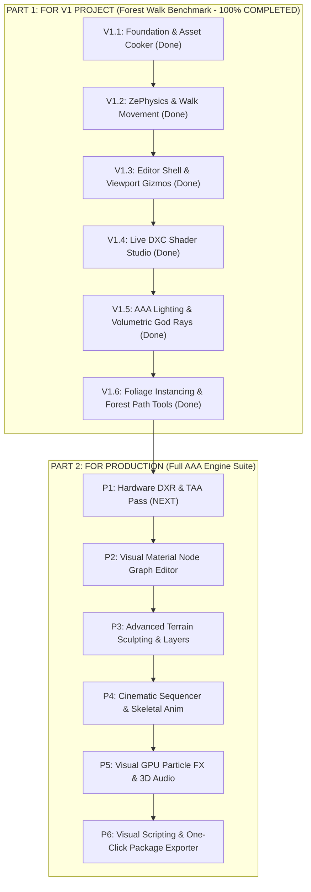

# BluemanEngine Master Roadmap (BluemanRM)

> **V1 Project Benchmark:** Highly Detailed 500m – 1km Walkable Forest & Path Environment with Modern AAA Lighting  
> **Core Subsystems:** ZeGFX D3D12 Renderer, ZePhysics 3D Simulation Engine, BluemanEngine Native Host  
> **Roadmap Structure:** Split into **Part 1: For V1 Project** and **Part 2: For Production**  

---

## 📋 Master Task Execution Checklist

*Track progress by ticking off tasks (`[x]`) upon completion.*

### 🌲 Part 1: V1 Forest Walk Benchmark Tasks
| Status | Task ID | Category | Task Description | Target Files / Subsystems |
| :---: | :--- | :--- | :--- | :--- |
| `[x]` | `TASK-V1-01` | Core Host | D3D12 Agility Native Host, 3-Frame Queue & Swapchain | `BluemanEngine/src/main.cpp` |
| `[x]` | `TASK-V1-02` | Asset Pipeline | Multithreaded Asynchronous Background Asset Cooker | `src/core/BackgroundAssetCooker.cpp` |
| `[x]` | `TASK-V1-03` | Asset Pipeline | Native Win32 File Browser Dialog Integration | `src/core/WindowsFileDialog.cpp` |
| `[x]` | `TASK-V1-04` | Physics Core | `ZePhysics` 3D Rigid Body Engine Tick Stepping | `src/render/ZeGFXAdapter.cpp` |
| `[x]` | `TASK-V1-05` | Viewport Nav | 6-DOF WASDQE Fly & Ground Walk Camera | `src/core/EditorCamera.cpp` |
| `[x]` | `TASK-V1-06` | Viewport Nav | Snapping 3D Gizmos (`ImGuizmo`) & Single-Step Undo/Redo | `src/panels/Viewport/Gizmos.cpp` |
| `[x]` | `TASK-V1-07` | Viewport UI | 3D Floor Grid & Sun Light Vector Viewport Overlays | `src/panels/Viewport/Overlay.cpp` |
| `[x]` | `TASK-V1-08` | Shader Studio | Live DXC Runtime HLSL Compiler & Line Diagnostics | `src/panels/ShaderStudio/ShaderStudioPanel.cpp` |
| `[x]` | `TASK-V1-09` | Editor Shell | ImGui Docking Layout, Frameless Chrome Title Bar | `src/panels/Chrome/CustomTitleBar.cpp` |
| `[x]` | `TASK-V1-10` | AAA Lighting | 4-Split Cascaded Directional Sun Shadows for Canopy | `src/render/ZeGFXAdapter.cpp`, `dx12_pipeline.cpp` |
| `[x]` | `TASK-V1-11` | Volumetrics | Volumetric Froxel Fog & Canopy Crepuscular God Rays | `VolumetricFogSystem.cpp`, `volumetric_fog.hlsl` |
| `[x]` | `TASK-V1-12` | AAA Lighting | `ZeGI` Probe Ambient Bounce under Dense Foliage | `ZeGFXAdapter.cpp`, `global_illumination/` |
| `[x]` | `TASK-V1-13` | AAA Lighting | Ground Ambient Occlusion Pass Binding (SSAO / GTAO) | `shaders/gtao_pass.hlsl`, `ssao_pass.cpp` |
| `[x]` | `TASK-V1-14` | Performance | High-Density Foliage Compute Culling (`ExecuteIndirect`) | `src/dx12/dx12_pipeline.cpp`, `virtual_geometry.cpp` |
| `[x]` | `TASK-V1-15` | Environment | 500m – 1km Playable Heightmap Terrain Chunking | `src/terrain_system.cpp` |
| `[x]` | `TASK-V1-16` | Level Editing | Forest Path Placement & Object Palette Scattering Tools | `src/panels/ObjectPalette/`, `OutlinerPanel.cpp` |

---

### 🚀 Part 2: Production Engine Suite Tasks
| Status | Task ID | Category | Task Description | Target Files / Subsystems |
| :---: | :--- | :--- | :--- | :--- |
| `[ ]` | `TASK-PROD-01` | DXR Core | Hardware DXR `DispatchRays` Shading Pipelines | `src/dx12/dx12_dxr.cpp` |
| `[ ]` | `TASK-PROD-02` | Post-Processing| Screen Space Reflections (SSR) Final Composition Pass | `shaders/ssr_pass.hlsl` |
| `[ ]` | `TASK-PROD-03` | Render Pipeline| Temporal Anti-Aliasing (TAA) Camera Jitter & Resolve | `src/core/EditorCamera.cpp`, `taa_pass.hlsl` |
| `[ ]` | `TASK-PROD-04` | Inspector | Per-Actor Rigid Body Details Inspector Controls | `src/panels/Details/DetailsPanel.cpp` |
| `[ ]` | `TASK-PROD-05` | Diagnostics | Virtual Geometry / Mesh LOD Debug Inspection Panel | `src/panels/Viewport/ViewportPanel.cpp` |
| `[ ]` | `TASK-PROD-06` | Material Node | Visual Material Node Graph Canvas & HLSL Code Generator | `src/panels/MaterialEditor/` |
| `[ ]` | `TASK-PROD-07` | Terrain Tools | Viewport Interactive 3D Terrain Sculpting Brushes | `src/tools/TerrainSculptTool.cpp` |
| `[ ]` | `TASK-PROD-08` | Animation | Track-Based Keyframe Timeline Sequencer Panel | `src/panels/Sequencer/` |
| `[ ]` | `TASK-PROD-09` | Animation Core| GPU Compute Skeletal Mesh Vertex Skinning Pass | `shaders/skinning_pass.hlsl` |
| `[ ]` | `TASK-PROD-10` | FX Subsystem | Visual GPU Particle Emitter Node Editor Panel | `src/panels/ParticleStudio/` |
| `[ ]` | `TASK-PROD-11` | Audio Core | Native Spatial 3D Audio Engine Subsystem Wrapper | `src/audio/AudioEngine.cpp` |
| `[ ]` | `TASK-PROD-12` | Gameplay | Visual Gameplay Scripting Graph Engine Panel | `src/panels/ScriptGraph/` |
| `[ ]` | `TASK-PROD-13` | Packaging | One-Click Standalone Game Package Shipping Exporter | `src/panels/ExportWizard/` |

---

## 🎯 V1 Project Target Vision: The Forest Walk Benchmark

The primary target for **BluemanEngine V1** is to comfortably render, run, and explore a **500m – 1km highly detailed forest environment** with a winding walking path, featuring:
* 🌲 **Dense Foliage & Tree Instancing:** High-density rendering of trees, rocks, shrubs, and grass running smoothly at high framerates via Virtual Geometry & Compute Culling (`ExecuteIndirect`).
* ☀️ **AAA Modern Lighting:** Sunlight filtering through tree canopies via 4-split Cascaded Directional Shadow Maps (PCF), Volumetric Froxel Fog with God Rays (light shafts), and dynamic `ZeGI` Probe Global Illumination under foliage.
* 🥾 **Walkable 3D Path & Navigation:** Interactive 6-DOF Fly & Ground Walk mode with `ZePhysics` terrain collision handling.
* 🎨 **Terrain & Scattering Tools:** Heightmap ground terrain chunks (500m–1km), object palette scattering, and path texturing.

---

## Roadmap Overview & Split Phase Summary

---

# PART 1: FOR V1 PROJECT

The following phases cover all core infrastructure, graphics, physics, and editor tools required to build, render, and play the **500m – 1km Detailed Forest Walk**.

| Milestone | Subsystem / Capability | V1 Scope & Deliverables | Status |
| :---: | :--- | :--- | :---: |
| **V1.1** | **Foundation & Asset Cooker** | Background baking of forest meshes (trees, rocks, foliage, path textures) to `.zmesh`/`.ztex`. | `[COMPLETED]` |
| **V1.2** | **ZePhysics & Collision** | Ground terrain collision heightfields & player collision bounds (`zephysics::PhysicsWorld`). | `[COMPLETED]` |
| **V1.3** | **Editor Shell & Viewport Navigation** | 6-DOF WASDQE Fly/Walk camera, `ImGuizmo` 3D placement handles, snapping, and Undo/Redo. | `[COMPLETED]` |
| **V1.4** | **Live DXC Shader Studio** | DXC runtime HLSL compiler panel for tweaking foliage, trunk bark, and terrain shaders live. | `[COMPLETED]` |
| **V1.5** | **AAA Lighting & Volumetrics** | 4-Split Sun Cascaded Shadows, Froxel God Rays, `ZeGI` Probe Ambient Bounce, and SSAO/GTAO. | `[COMPLETED]` |
| **V1.6** | **Foliage Instancing & Path Tools**| High-density instance drawing (`ExecuteIndirect`), 500m-1km terrain chunking, and path placement. | `[COMPLETED]` |

---

### Detailed V1 Project Phase Breakdown

#### Phase V1.1: Asset Cooker & Foundation `[COMPLETED]`
* **Multithreaded Cooker:** Background thread asset compilation (`BackgroundAssetCooker`) converting raw FBX/GLTF tree models, rocks, and ground textures into binary `.zmesh` and compressed `.ztex` files.
* **Native Win32 File Dialog:** Asset import browser for loading environment art assets into `"Z:\Blueman Cooked Assets"`.

#### Phase V1.2: Physics & Player Collision `[COMPLETED]`
* **ZePhysics Engine Integration:** `zephysics::PhysicsWorld` running continuous stepping (`StepSimulation`) in `ZeGFXAdapter`.
* **Walk & Ground Collision:** Collision detection for the walkable 500m–1km terrain surface and path bounds.

#### Phase V1.3: Editor Shell & Viewport Navigation `[COMPLETED]`
* **6-DOF Fly & Ground Walk Modes:** `WASDQE` camera controls with speed boost, orbit/pan, cursor lock, and ground-stick walking mode.
* **Snapping 3D Gizmos:** `ImGuizmo` Translate/Rotate/Scale handles for placing trees, rocks, and path lights in 3D space with Undo/Redo commands.

#### Phase V1.4: Live DXC Shader Studio `[COMPLETED]`
* **Live HLSL Shader Tweaking:** Real-time DXC compiler panel with line diagnostic highlights for editing leaf sub-surface scattering, bark PBR shaders, and ground terrain blend shaders on the fly.

#### Phase V1.5: AAA Modern Forest Lighting & Volumetrics `[COMPLETED]`
> **Goal:** Deliver AAA-grade lighting for the forest walk (Sun shafts, canopy shadows, ambient bounces, volumetric mist).

* **Task V1.5.1: Canopy Sun Shadows (4-Split PCF Cascades)**
  * Tune 4 directional shadow splits in `ZeGFXAdapter` with PCF filtering for sharp/soft shadows under dense tree branches.
* **Task V1.5.2: Volumetric God Rays & Froxel Fog**
  * Utilize bindless two-pass compute volumetric fog to render crepuscular rays (God Rays) piercing through forest canopy openings.
* **Task V1.5.3: Foliage Ambient Bounce (`ZeGI` Probes)**
  * Enable `ZeGI` probe volumes (`GlobalIlluminationMode::RayTracedProbes`) for natural green/brown diffuse bounce under dark foliage.
* **Task V1.5.4: Ground Ambient Occlusion (SSAO & GTAO)**
  * Bind Ground Truth Ambient Occlusion (GTAO) and SSAO bilateral filtering to ground rocks, tree trunks, and path soil crevices.
* **Task V1.5.5: ACES Tonemapping & Bloom**
  * Auto-exposure compute histograms and ACES color grading tuned for dramatic sunlight breaking into shaded forest trails.

#### Phase V1.6: Foliage Instancing & Forest Path Tools `[COMPLETED]`
> **Goal:** Enable high-density forest rendering across 500m – 1km without performance degradation.

* **Task V1.6.1: High-Density Foliage Instancing (`ExecuteIndirect`)**
  * Wire ZeGFX virtual geometry and GPU compute culling shaders to render thousands of instanced trees, bushes, and grass blades in a single GPU draw call.
* **Task V1.6.2: 500m – 1km Walkable Terrain Chunking**
  * Configure heightmap terrain chunking (`src/terrain_system.cpp`) for the 500m–1km playable area with dynamic LOD distance falloffs.
* **Task V1.6.3: Forest Path Placement & Object Palette**
  * Use Object Palette and Outliner tools to quickly paint/place rocks, path markers, and ambient lights along the forest trail.

---

# PART 2: FOR PRODUCTION

The following advanced phases cover full-suite engine capabilities required beyond V1 for commercial multi-genre game production.

| Phase | Milestone Name | Advanced Engine Capability | Status |
| :---: | :--- | :--- | :---: |
| **P1** | **Hardware DXR & TAA** | Hardware GPU `DispatchRays` (DXR Reflections/AO) & TAA jitter resolve pass. | `[NEXT PHASE]` |
| **P2** | **Visual Material Node Graph**| Drag-and-drop node graph canvas generating custom HLSL PBR material shaders. | `[PRODUCTION]` |
| **P3** | **Advanced Terrain Sculpting**| Interactive 3D Viewport sculpting brushes (Raise/Lower/Smooth) & multi-layer splatmaps. | `[PRODUCTION]` |
| **P4** | **Sequencer & Animation** | Keyframe timeline track editor & GPU compute skeletal mesh vertex skinning pass. | `[PRODUCTION]` |
| **P5** | **Particle FX & Audio Core** | Compute GPU particle emitter node editor & native 3D spatial audio subsystem. | `[PRODUCTION]` |
| **P6** | **Scripting & Exporter** | Visual gameplay logic scripting engine & One-Click standalone `.exe` shipping packaging wizard. | `[PRODUCTION]` |

---

### Detailed Production Phase Breakdown

#### Phase P1: Hardware DXR Ray Tracing & TAA Pass
* **Hardware GPU `DispatchRays`:** Active GPU raytracing dispatches for DXR Ray Traced Reflections, Shadows, and Ambient Occlusion.
* **Temporal Anti-Aliasing (TAA):** Sub-pixel camera jitter matrices, velocity buffers, and temporal accumulation.

#### Phase P2: Visual Material Node Graph Editor
* **Node Canvas Editor:** Interactive visual node editor (Math, Texture, PBR Output) compiling into HLSL code.
* **Live Material Preview Viewport:** Real-time 3D sphere material thumbnail preview.

#### Phase P3: Advanced Terrain Sculpting & Painting
* **3D Sculpting Brushes:** Viewport sculpting brushes (Raise, Lower, Smooth, Flatten) and multi-layer weight painting.

#### Phase P4: Cinematic Sequencer & Skeletal Animation
* **Keyframe Timeline:** Track-based timeline for camera motion paths and actor channel keyframing.
* **Skeletal Mesh Skinning:** GPU compute vertex skinning pass and animation state machine graph.

#### Phase P5: Visual GPU Particle FX & Spatial Audio
* **Compute Particle Simulation:** Node-based particle emitter editor for environmental leaf drift, dust motes, and rain.
* **Spatial 3D Audio Subsystem:** Native 3D audio emitter positioning, footstep sounds, and environmental acoustics.

#### Phase P6: Visual Scripting & One-Click Shipping Exporter
* **Visual Scripting Engine:** Node-based gameplay logic editor with flow control (Branch, Loop, Gate) and event triggers.
* **One-Click Packaging Shipping Wizard:** Single-click export wizard bundling shader packs (`.zeshaderpack`), scene assets, and binaries into a standalone executable.

---
*Document updated for project architecture alignment under `BluemanEngine / ZeGFX`.*
